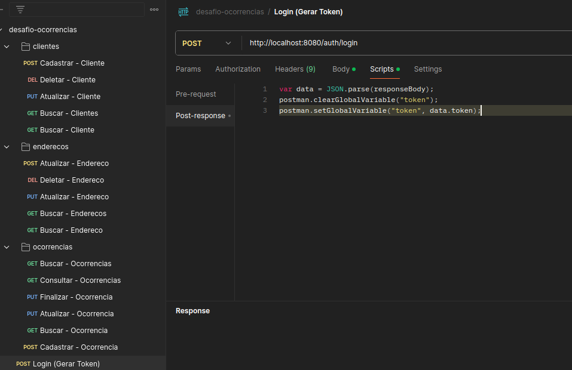
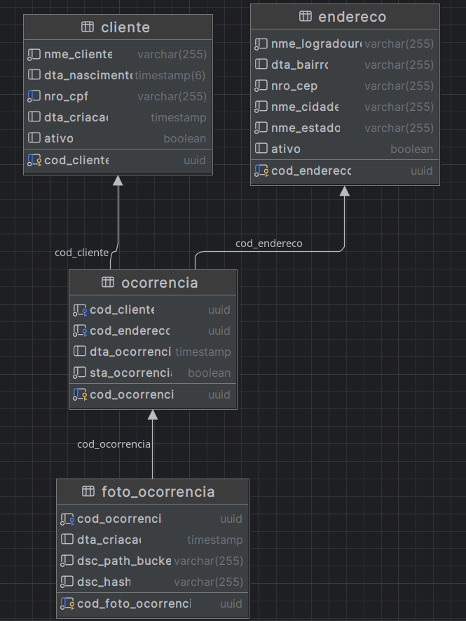

# Desafio Técnico | Back-end | Java

<h3>

</h3>

API em Java 17 com spring-boot 3.3.5 
Base de dados PostgreSQL 13  
Storage em MinIO  
Spring Security 6.3.4 com JWT  
Versionamento de DB com Flyway 10  
Testes com JUnit 5.10.2 e Mockito  
API, DB e Storage containerizados com Docker e orquestrados com docker-compose
 

## Executando em ambiente local com Docker 🐋
A partir da pasta raiz do projeto, onde se encontra o arquivo docker-compose.yml, execute o comando para iniciar o container:
> docker-compose up --build
>

### Requisições:
  
Há um arquivo de collections para importação das requisições em   ocorrencias-api/src/main/resources/assets/<b>desafio-ocorrencias.postman_collection.json</b>  
Foi configurado um script para copiar o valor do token para uma variável no postman:

  

Feito isso, verifique se os containers estão em execução e faça uma requisição na API 
utilizando Postman, ou outro software de sua preferência:
> localhost:8080/auth/login
`{
    "username": "user",
    "password": "secreta"
}`
 

# Modelagem de dados

  

